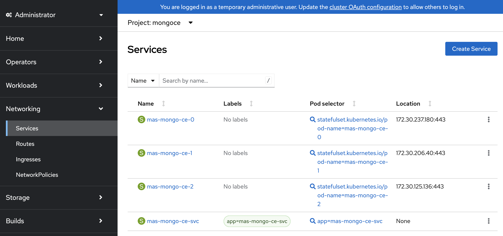
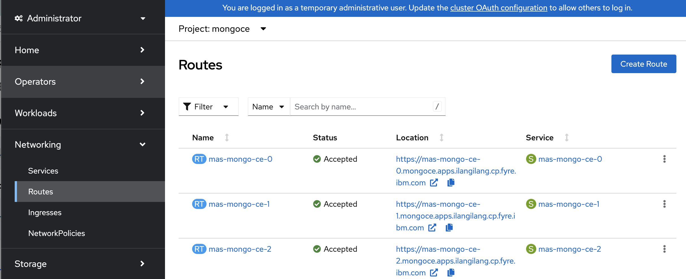
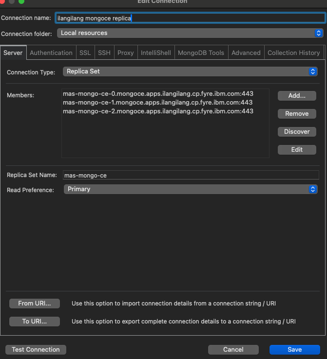
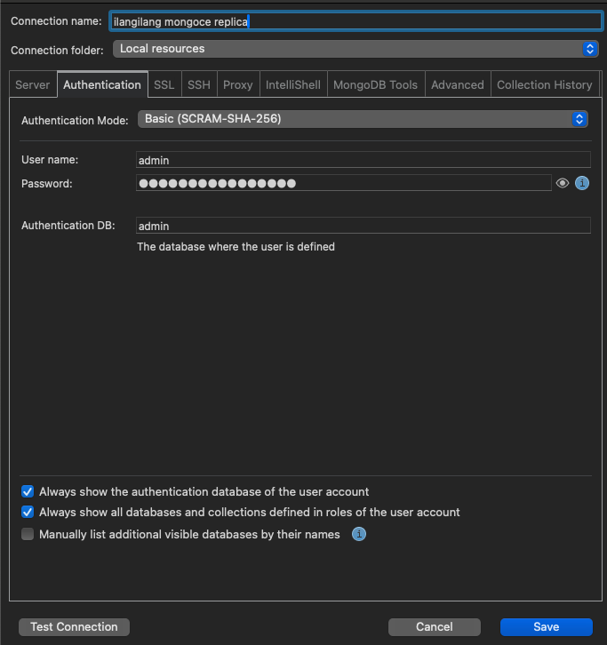
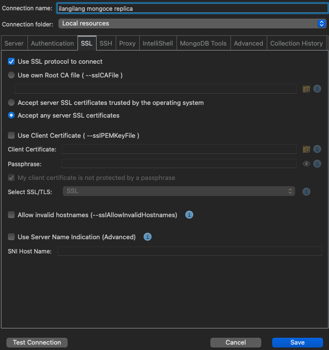
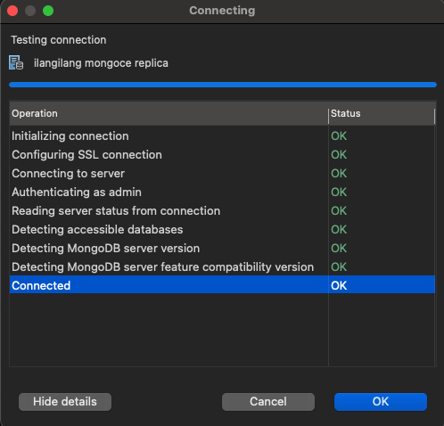

# Exposing a MAS Instance's MongoDB CE

This doc deals with exposing a MongoDB CE instance used as a dependency of MAS deployed in Red Hat OpenShift, following the procedure written by Daniel Istrate [here](https://www.linkedin.com/pulse/expose-mongdb-community-edition-redhat-openshift-daniel-istrate/). 

The steps were tested using MongoDB CE v7.0.22, used by MAS v9.0.14, `ibm-operator-catalog` version `v9-250902-amd64`, OCP v4.16.45 (console-openshift-console.apps.ilangilang.cp.fyre.ibm.com in this example, please do not attempt to access it) . In the following steps, the MongoDB instance is configured to serve as an external MongoDB for another MAS instance v9.1.x, using the same ibm-operator-catalog version in OCP 4.16.x.

1. Create the services and routes for the mongodb replicas. Apply the following yamls separately. **_Note: Update domains accordingly where appropriate._**

#### Services

```yaml
kind: Service
apiVersion: v1
metadata:
  name: mas-mongo-ce-0
  namespace: mongoce
spec:
  ports:
    - name: mongodb
      protocol: TCP
      port: 443
      targetPort: 27017
  selector:
    statefulset.kubernetes.io/pod-name: mas-mongo-ce-0
```
```yaml
kind: Service
apiVersion: v1
metadata:
  name: mas-mongo-ce-1
  namespace: mongoce
spec:
  ports:
    - name: mongodb
      protocol: TCP
      port: 443
      targetPort: 27017
  selector:
    statefulset.kubernetes.io/pod-name: mas-mongo-ce-1
```
```yaml
kind: Service
apiVersion: v1
metadata:
  name: mas-mongo-ce-2
  namespace: mongoce
spec:
  ports:
    - name: mongodb
      protocol: TCP
      port: 443
      targetPort: 27017
  selector:
    statefulset.kubernetes.io/pod-name: mas-mongo-ce-2
```
After this, there are three additional services in the mongoce namespace:


#### Routes 

```yaml
apiVersion: route.openshift.io/v1
kind: Route
metadata:
  name: mas-mongo-ce-0
  namespace: mongoce
spec:
  host: mas-mongo-ce-0.mongoce.apps.example.com
  to:
    kind: Service
    name: mas-mongo-ce-0
  tls:
    termination: passthrough
```
```yaml
apiVersion: route.openshift.io/v1
kind: Route
metadata:
  name: mas-mongo-ce-1
  namespace: mongoce
spec:
  host: mas-mongo-ce-1.mongoce.apps.example.com
  to:
    kind: Service
    name: mas-mongo-ce-1
  tls:
    termination: passthrough
```
```yaml
apiVersion: route.openshift.io/v1
kind: Route
metadata:
  name: mas-mongo-ce-2
  namespace: mongoce
spec:
  host: mas-mongo-ce-2.mongoce.apps.example.com
  to:
    kind: Service
    name: mas-mongo-ce-2
  tls:
    termination: passthrough
```
New routes created:


2. Copy the hosts from these external routes.

```
mas-mongo-ce-0.mongoce.apps.example.com
mas-mongo-ce-1.mongoce.apps.example.com
mas-mongo-ce-2.mongoce.apps.example.com
````
3. Update the certificates and secret to add the external hostnames.

Go to Home > Search in OpenShift console, select the mongoce project and search for resource type Certificate. The following certificates will be listed:

- `mongo-ca-crt`
- `mongo-server`

Modify mongo-ca-crt yaml `spec.dnsNames` list with the following:

```yaml
    - mas-mongo-ce-0.mongoce.svc.cluster.local
    - mas-mongo-ce-1.mongoce.svc.cluster.local
    - mas-mongo-ce-2.mongoce.svc.cluster.local
    - mas-mongo-ce-0.mongoce.apps.example.com
    - mas-mongo-ce-1.mongoce.apps.example.com
    - mas-mongo-ce-2.mongoce.apps.example.com
```
Do the same for mongo-server.

Resulting yamls of certificates:

`mongo-ca-crt`:
```
apiVersion: cert-manager.io/v1
kind: Certificate
metadata:
  annotations:
    kubectl.kubernetes.io/last-applied-configuration: ''
 <snip>
  name: mongo-ca-crt
  namespace: mongoce
spec:
  commonName: mongo-ca-crt
  dnsNames:
    - '*.mas-mongo-ce-svc.mongoce.svc.cluster.local'
    - 127.0.0.1
    - localhost
    - mas-mongo-ce-0.mongoce.svc.cluster.local
    - mas-mongo-ce-1.mongoce.svc.cluster.local
    - mas-mongo-ce-2.mongoce.svc.cluster.local
    - mas-mongo-ce-0.mongoce.apps.ilangilang.cp.fyre.ibm.com
    - mas-mongo-ce-1.mongoce.apps.ilangilang.cp.fyre.ibm.com
    - mas-mongo-ce-2.mongoce.apps.ilangilang.cp.fyre.ibm.com
  duration: 175200h
  isCA: true
  issuerRef:
    group: cert-manager.io
    kind: Issuer
    name: mongo-issuer
  privateKey:
    algorithm: ECDSA
    size: 256
  secretName: mongo-ca-secret
```
`mongo-server`:
```
apiVersion: cert-manager.io/v1
kind: Certificate
metadata:
  annotations:
    kubectl.kubernetes.io/last-applied-configuration: ''
  name: mongo-server
  namespace: mongoce
spec:
  dnsNames:
    - '*.mas-mongo-ce-svc.mongoce.svc.cluster.local'
    - 127.0.0.1
    - localhost
    - mas-mongo-ce-0.mongoce.svc.cluster.local
    - mas-mongo-ce-1.mongoce.svc.cluster.local
    - mas-mongo-ce-2.mongoce.svc.cluster.local
    - mas-mongo-ce-0.mongoce.apps.ilangilang.cp.fyre.ibm.com
    - mas-mongo-ce-1.mongoce.apps.ilangilang.cp.fyre.ibm.com
    - mas-mongo-ce-2.mongoce.apps.ilangilang.cp.fyre.ibm.com
  duration: 8760h
  issuerRef:
    name: mongo-server-cert-issuer
  renewBefore: 360h
  secretName: mongo-server-cert
```

4. Get the ca certificate from the mongo-server-cert:

```
oc extract secret/mongo-server-cert -n mongoce --keys=ca.crt --to=- > ca.crt
```

5. Update the ConfigMap mas-mongo-ce-cert-map with the new ca.crt you got from the preceding step.

```
kind: ConfigMap
apiVersion: v1
metadata:
  name: mas-mongo-ce-cert-map
  namespace: mongoce
data:
  ca.crt: |
    -----BEGIN CERTIFICATE-----
    ....
    -----END CERTIFICATE-----
```

6. Restart the mas-mongo-ce pods.

7. Update the mongoDBCommunity CR's `spec.replicaSetHorizons` as follows:

```
spec:
  replicaSetHorizons:
    - ocroute: 'mas-mongo-ce-0.mongoce.apps.example.com:443'
      ocsvc: 'mas-mongo-ce-0.mongoce.svc.cluster.local:443'
    - ocroute: 'mas-mongo-ce-1.mongoce.apps.example.com:443'
      ocsvc: 'mas-mongo-ce-1.mongoce.svc.cluster.local:443'
    - ocroute: mas-mongo-ce-2.mongoce.apps.example.com:443
      ocsvc: 'mas-mongo-ce-2.mongoce.svc.cluster.local:443'
```

```yaml
apiVersion: mongodbcommunity.mongodb.com/v1
kind: MongoDBCommunity
metadata:
  annotations:
    kubectl.kubernetes.io/last-applied-configuration: 'xxx'
    mongodb.com/v1.lastAppliedMongoDBVersion: 7.0.22
    mongodb.com/v1.lastSuccessfulConfiguration: 'xxx'
  name: mas-mongo-ce
  namespace: mongoce
spec:
  security:
    authentication:
      ignoreUnknownUsers: true
      modes:
        - SCRAM-SHA-256
        - SCRAM-SHA-1
    tls:
      caConfigMapRef:
        name: mas-mongo-ce-cert-map
      certificateKeySecretRef:
        name: mongo-server-cert
      enabled: true
  replicaSetHorizons:
    - ocroute: 'mas-mongo-ce-0.mongoce.apps.ilangilang.cp.fyre.ibm.com:443'
      ocsvc: 'mas-mongo-ce-0.mongoce.svc.cluster.local:443'
    - ocroute: 'mas-mongo-ce-1.mongoce.apps.ilangilang.cp.fyre.ibm.com:443'
      ocsvc: 'mas-mongo-ce-1.mongoce.svc.cluster.local:443'
    - ocroute: 'mas-mongo-ce-2.mongoce.apps.ilangilang.cp.fyre.ibm.com:443'
      ocsvc: 'mas-mongo-ce-2.mongoce.svc.cluster.local:443'
  users:
    - db: xxxxx
      name: xxxxx 
      passwordSecretRef:
        name: mas-mongo-ce-admin-password
      roles:
        - db: xxxxx
          name: clusterAdmin
        - db: xxxxx
          name: userAdminAnyDatabase
        - db: xxxxx
          name: dbOwner
        - db: xxxxx
          name: readWriteAnyDatabase
      scramCredentialsSecretName: mas-mongo-ce-scram
  prometheus:
    passwordSecretRef:
      name: mas-mongo-ce-metrics-endpoint-secret
    username: metrics-endpoint-user
  statefulSet:
    spec:
      selector: {}
      serviceName: mas-mongo-ce-svc
      template:
        spec:
          containers:
            - image: 'quay.io/ibmmas/xxxx'
              name: mongod
              resources:
                limits:
                  cpu: '1'
                  memory: 1Gi
                requests:
                  cpu: 500m
                  memory: 1Gi
      volumeClaimTemplates:
        - metadata:
            name: data-volume
          spec:
            accessModes:
              - ReadWriteOnce
            resources:
              requests:
                storage: 20Gi
            storageClassName: nfs-client
        - metadata:
            name: logs-volume
          spec:
            accessModes:
              - ReadWriteOnce
            resources:
              requests:
                storage: 20Gi
            storageClassName: nfs-client
  version: 7.0.22
  members: 3
  additionalMongodConfig:
    net.tls.allowInvalidCertificates: true
    net.tls.allowInvalidHostnames: true
    storage.wiredTiger.engineConfig.journalCompressor: snappy
  type: ReplicaSet
  featureCompatibilityVersion: '7.0'
```

8. Wait for the mongoDBcommunity CR to become 'READY'.

```
status:
  currentMongoDBMembers: 3
  currentStatefulSetReplicas: 3
  mongoUri: 'mongodb://mas-mongo-ce-0.mas-mongo-ce-svc.mongoce.svc.cluster.local:27017,mas-mongo-ce-1.mas-mongo-ce-svc.mongoce.svc.cluster.local:27017,mas-mongo-ce-2.mas-mongo-ce-svc.mongoce.svc.cluster.local:27017/?replicaSet=mas-mongo-ce'
  phase: Running
  version: 7.0.22
```

9. Test if you can connect to the mongodb replicas externally. You can use any tool to do this. Please follow the instructions in https://www.linkedin.com/pulse/expose-mongdb-community-edition-redhat-openshift-daniel-istrate/

Data needed:
- hosts and port

See hosts above, step 2. For the port, use 443.

For example:
```
mas-mongo-ce-0.mongoce.apps.ilangilang.cp.fyre.ibm.com:443
mas-mongo-ce-1.mongoce.apps.ilangilang.cp.fyre.ibm.com:443
mas-mongo-ce-2.mongoce.apps.ilangilang.cp.fyre.ibm.com:443
```
- mongodb credentials

Get the value of `mas-mongo-ce-admin-admin` secret in the mongoce namespace.

`oc get secret mas-mongo-ce-admin-admin -n mongoce -o yaml  | yq .data.password |  base64 -d`

- mongo cert

This will be the `ca.crt` from step 4.

**In Studio3T:**





*Testing the connection:*



If connection is successful, proceed to MAS installation. Otherwise, check the configuration again.