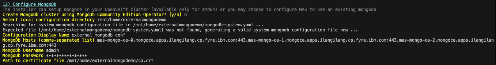
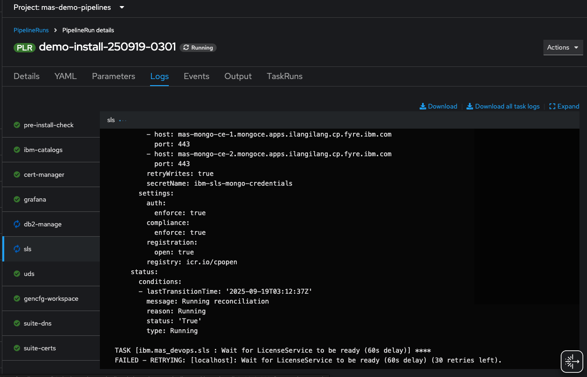
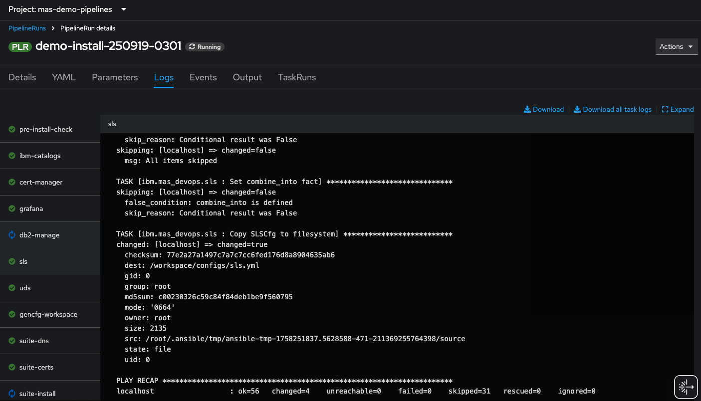

# Installing MAS with an External MongoDB

The following are the steps in installing MAS using an external mongodb instance deployed in a separate OpenShift cluster (where another MAS instance is also deployed and using that mongodb instance as a dependency), following this [document](https://www.ibm.com/support/pages/installing-mas-using-ibm-mas-cli-utility). It assumes that the [IBM MAS CLI](https://ibm-mas.github.io/cli/) container has been created. In the test, MAS CLI v15.5.0 was used to install MAS v9.1.x on OCP cluster is v4.18, `ibm-operator-catalog` version `v9-250828-amd64`.

1. Prepare the requirements for the installation.
- The MAS license file should be the same as the one from the external mongodb.
```
[ibmmas/cli:15.5.0]mascli$ ls /mnt/home/licenses/license.dat
/mnt/home/licenses/license.dat
```
- In this example, the configuration file for the external mongodb will be created during the installation. A copy of the mongodb certificate (obtained in step 4 [here](./exposeMongoDB.md)) should be in hand and accessible in the MAS CLI container.

```
[ibmmas/cli:15.5.0]mascli$ ls /mnt/home/externalmongodemo
ca.crt
```
- MongoDB credentials, see step 9, data needed to test the [exposed MongoDB instance](./exposeMongoDB.md).

2. Log in to the OCP cluster and run `mas install`.

3. When getting to number 12, "Configure MongoDb", provide 'n' as answer to question "Create MongoDB cluster using MongoDb Community Edition Operator? [y/n]". Provide the information being prompted.



The following yaml file is generated in the provided path above.

```
mas@controlav1:~/externalmongodemo$ cat mongodb-system.yaml
---
# Mongo credentials for MAS
apiVersion: v1
kind: Secret
type: Opaque
metadata:
  name: mongodb-demo-admin
  namespace: mas-demo-core

data:
  username: "xxx"
  password: "xxx"
---
# Mongo configuration for MAS
apiVersion: config.mas.ibm.com/v1
kind: MongoCfg
metadata:
  name: demo-mongo-system
  namespace: mas-demo-core
  labels:
    mas.ibm.com/configScope: system
    mas.ibm.com/instanceId: demo

spec:
  displayName: "External MongoDB in 'mas-demo-core' namespace"
  type: external
  config:
    configDb: admin
    retryWrites: true
    authMechanism: DEFAULT
    credentials:
      secretName: mongodb-demo-admin
    hosts:
     - host: mas-mongo-ce-0.mongoce.apps.ilangilang.cp.fyre.ibm.com
       port: 443
     - host: mas-mongo-ce-1.mongoce.apps.ilangilang.cp.fyre.ibm.com
       port: 443
     - host: mas-mongo-ce-2.mongoce.apps.ilangilang.cp.fyre.ibm.com
       port: 443
  certificates:
    - alias: "part1"
      crt: |
        -----BEGIN CERTIFICATE-----
        <snip>
        -----END CERTIFICATE-----
```

4. Finish the rest of the questions provided by the installer. A pipeline should be created. The logs will show that there won't be a mongo step.



The sls logs will show early on if there are errors. Below shows that the mongo configuration was ok as the sls step has finished successfully.



...to be continued to show finished installation.